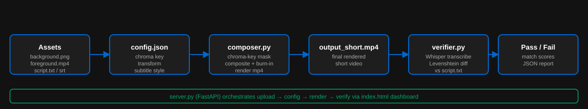

# shorts-composer

Compose short videos from background subtitles and chrome keyed footage.

Repo: https://github.com/rifaterdemsahin/shorts-composer/tree/main
GitHub Pages: https://rifaterdemsahin.github.io/shorts-composer/

A macOS Apple Silicon native video compositing API designed for AI agents. It handles background replacement, chroma-keying, subtitle burn-in, and verification against ground-truth scripts.

## Pipeline



## Setup on macOS (M1/M2/M3)

1. **Install System Dependencies**
   ```bash
   brew install ffmpeg imagemagick
   ```
   ImageMagick 7's default policy blocks the text-rendering coders MoviePy needs for
   subtitle burn-in. Allow them by editing the `coder` policy in
   `$(brew --prefix)/etc/ImageMagick-7/policy.xml` (the file itself is a symlink into
   the Cellar) so it reads:
   ```xml
   <policy domain="coder" rights="read|write" pattern="{GIF,JPEG,PNG,WEBP,LABEL,CAPTION,MVG,PANGO,TEXT,PS,XC}" />
   ```

2. **Install Python Environment**
   ```bash
   python3 -m venv venv
   source venv/bin/activate
   pip install -r requirements.txt
   ```

3. **Run the Server**
   ```bash
   source venv/bin/activate
   python server.py
   ```

- Client-side layer editor: `http://localhost:8000/`
- Server-side pipeline test page (run + live logs + Whisper verification):
  `http://localhost:8000/test`

## Default demo assets

`assets/default-background.jpg`, `assets/default-aroll.webm` are bundled so the
pipeline runs out of the box — `config.json` points at them already. Real subtitles
(`assets/subtitles.srt`) and the ground-truth script (`assets/script.txt`) were
generated once from the a-roll's actual narration with
`python scripts/generate_subtitles.py` (re-run it if you swap in your own a-roll).

`assets/default-subtitles.webm` is a silent branding/bumper clip (no speech), bundled
for reference but not wired into the composite.

The bundled a-roll has a real (non-green-screen) backdrop, so RGB-distance chroma
keying can't cleanly separate it from skin tones — `chroma_key.threshold` is `0` in
`config.json`, which skips keying and composites the a-roll as an opaque inset over
the background instead. Point `foreground_video` at real green-screen footage and set
`threshold` to ~60-90 to enable true keying.
